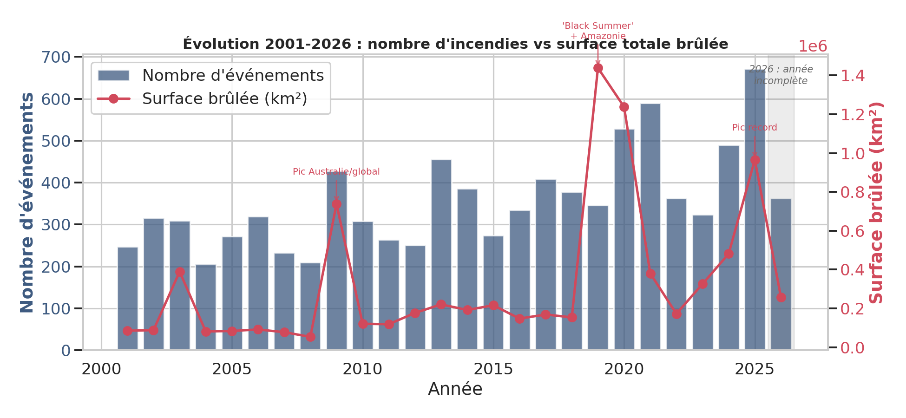
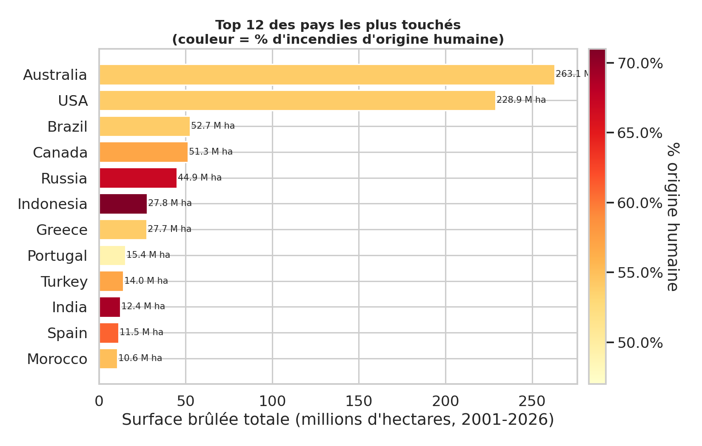
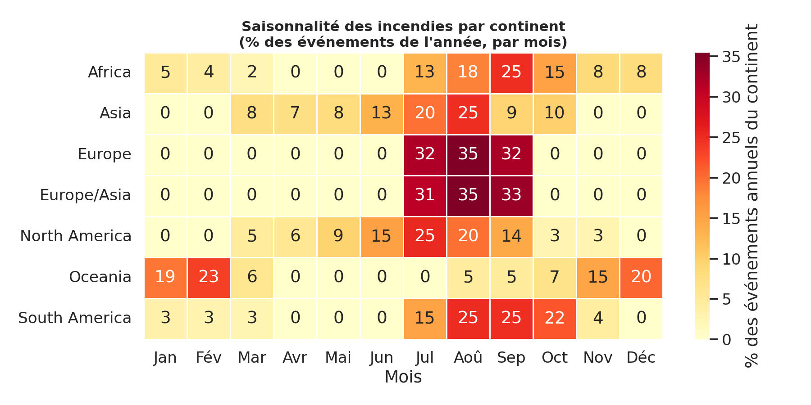
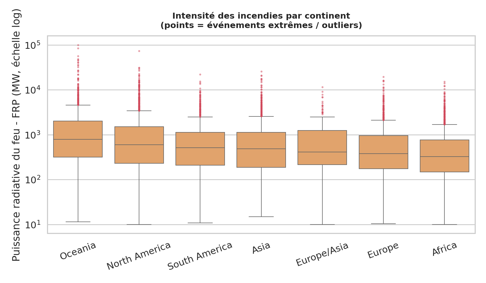
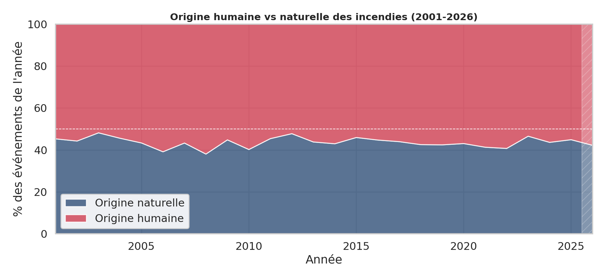
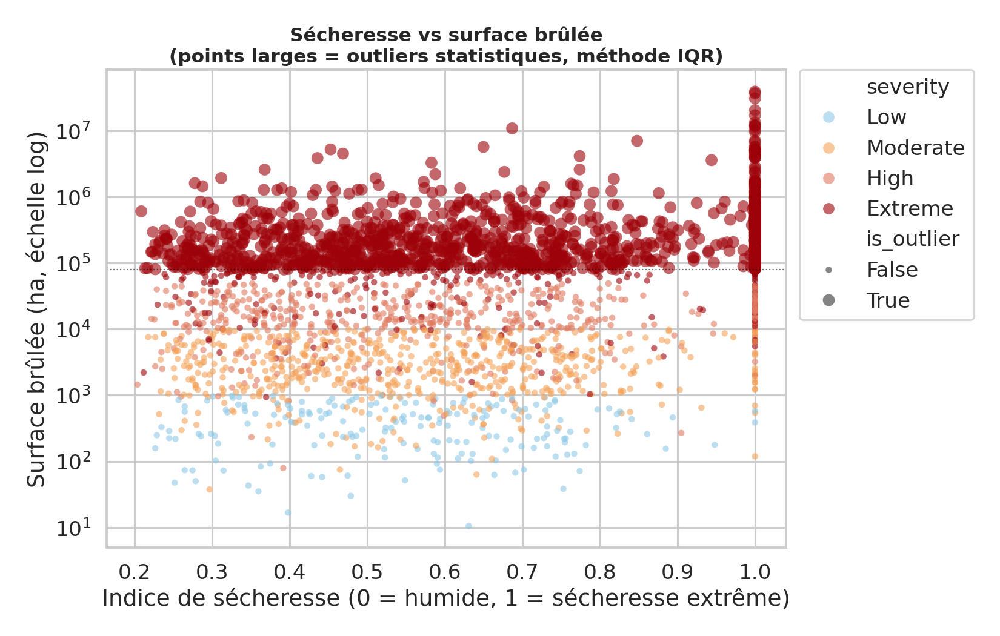
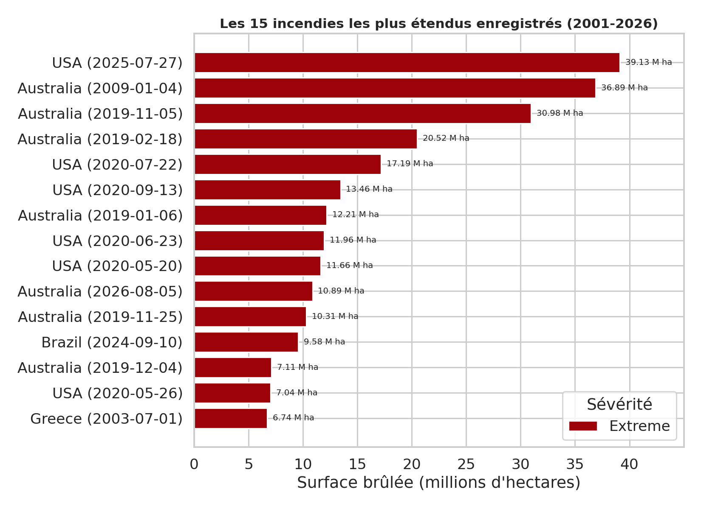
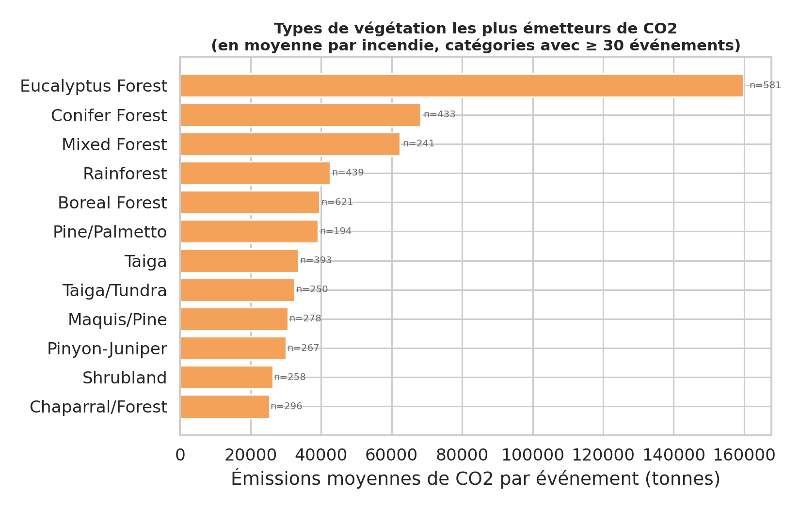

# 🔥 Analyse des feux de forêt (2001–2026)

Synthèse des principaux enseignements tirés du jeu de données (9 277 événements, 25 pays).

## Points clés identifiés

### 📈 Tendance de fond
Hausse nette du nombre d'événements **et** de la surface brûlée depuis 2001, avec des pics marquants en :
- **2009** — Australie
- **2019–2021** — *"Black Summer"* australien + incendies en Amazonie
- **2025** — record historique

> **Note méthodologique** : 2026 apparaît avec moins d'événements, mais il ne s'agit pas d'une troncature de données — le fichier contient des événements simulés jusqu'à décembre 2026.

*Nombre d'événements (barres) vs surface totale brûlée (courbe), 2001–2026.*

### 🌍 Concentration géographique
L'**Australie** et les **USA** dominent très largement en surface cumulée brûlée. L'**Indonésie** et l'**Inde** affichent la plus forte part d'origine humaine parmi les gros contributeurs.

*Surface brûlée totale par pays (2001–2026), colorée selon le % d'incendies d'origine humaine.*

### 🗓️ Saisonnalité
Décalage net entre hémisphères :
| Zone | Saison des feux |
|---|---|
| Océanie (hémisphère sud) | Été austral (déc–fév) |
| Europe / Amérique du Nord (hémisphère nord) | Été boréal (juil–sep) |

*% des événements annuels de chaque continent, par mois — le décalage Nord/Sud est net.*

### 🔥 Intensité par continent
La puissance radiative du feu (FRP) présente une distribution très asymétrique sur tous les continents, avec un grand nombre d'événements extrêmes (outliers) au-dessus de valeurs médianes pourtant proches d'un continent à l'autre.

*Distribution de la FRP (échelle log) par continent ; les points rouges sont des outliers statistiques.*

### 👤 Origine humaine vs naturelle
Proportion étonnamment **stable dans le temps** (~44–48 %), sans tendance nette à la hausse ou à la baisse sur 25 ans.

*Part des événements d'origine humaine et naturelle, par année.*

### 📊 Outliers statistiques
**1 272 événements** dépassent le seuil statistique (méthode IQR) sur la surface brûlée. L'événement le plus extrême (USA, juillet 2025, ~39 M ha) dépasse la superficie de l'Allemagne pour un seul incendie — à vérifier s'il s'agit d'une anomalie de saisie plutôt que d'un événement réel.

*Relation entre indice de sécheresse et surface brûlée ; les points larges sont les outliers IQR.*

*Classement nommé des 15 événements les plus extrêmes enregistrés.*

### 🌲 Végétation
Les **forêts d'eucalyptus** (Australie) émettent en moyenne bien plus de CO₂ par incendie que tout autre type de végétation.

*Émissions moyennes de CO₂ par événement, pour les 12 types de végétation les plus documentés.*

---

## 🔍 Qualité des données

Un contrôle qualité approfondi a révélé deux points d'attention :

- **Dates "futures"** : 249 événements datés après juillet 2026 (jusqu'à décembre 2026) — année simulée/prévisionnelle plutôt que troncature.
- **Clipping suspect** : accumulation anormale de valeurs à `drought_index = 1.0`, signe probable d'un plafonnement de la variable plutôt qu'un phénomène naturel.

---
